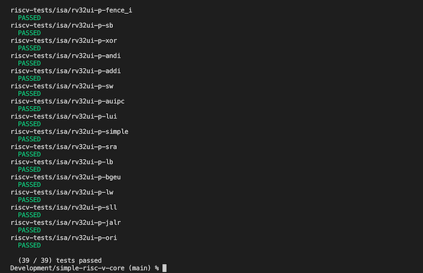

Dependencies
------------

In the project root, download and compile the riscv-test:

    $ git clone https://github.com/riscv/riscv-tests
    $ cd riscv-tests
    $ git submodule update --init --recursive
    $ autoconf
    $ ./configure --prefix=$RISCV/target
    $ make

Compiling
---------

    $ make

Running a single test
---------------------

    $ ./riscv-core riscv-tests/isa/rv32ui-p-add

Example output:

Running all rv32ui-p tests
--------------------------

    $ ./test-rv32ui-p.rb

Example output:

Reference
---------

* [RISC-V ISA](https://riscv.org/technical/specifications/)
* https://en.wikipedia.org/wiki/Executable_and_Linkable_Format

Dependencies
------------

* [riscv-tests](https://github.com/riscv-software-src/riscv-tests)
* https://github.com/0intro/libelf ([forked](https://github.com/tomriley/libelf))
