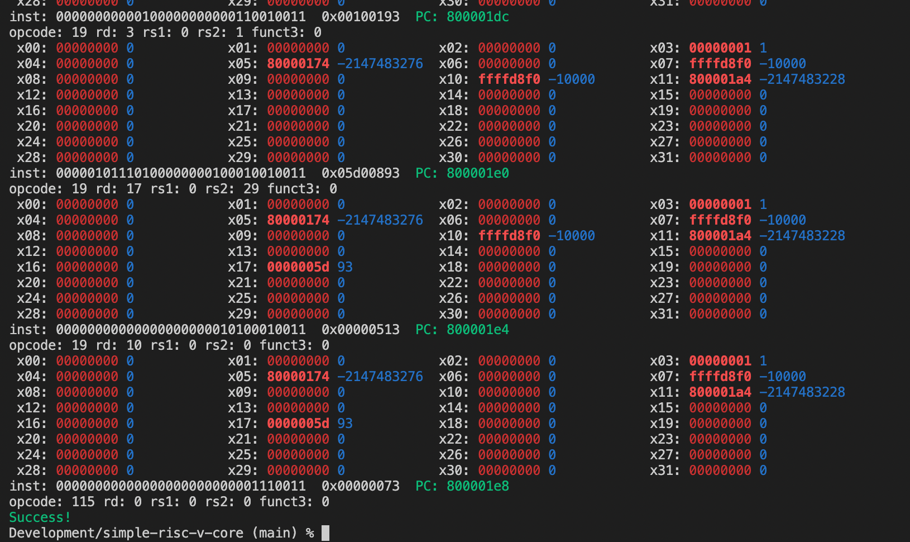

A RISC-V core written in C and then in Verilog. The aim of this project is to progressively learn more about the RISC-V ISA, learn Verilog and HDL in general, and more about how CPUs are implemented in hardware.

Dependencies
------------

In the project root, download and compile the riscv-tests:

    $ git clone https://github.com/riscv/riscv-tests
    $ cd riscv-tests
    $ git submodule update --init --recursive
    $ autoconf
    $ ./configure
    $ make

This will compile the ISA tests into individual ELF files. These ELF file can be run as described below.

Compile & run all RISCV ISA tests
---------------------------------

    $ make
    $ make test

Run a single test
-----------------

    $ ./riscv-core riscv-tests/isa/rv32ui-p-add

Command line options
--------------------

To print out current register values before each step run with -r option:

    $ ./riscv-core riscv-tests/isa/rv32ui-p-add -r

The Verilog version needs to load initial memory state from an ascii hex dump. You can generate this file by passing -h flag when running the C version. For example:

    $ ./riscv-core riscv-tests/isa/rv32ui-p-add -h

Will load the ELF file into memory then dump the memory to a hex file located at **verilog/tests/rv32ui-p-add.hex**. That file can then be run on the Verilog version as described below.

Compile & run all tests (Verilog)
---------------------------------

    $ cd verilog
    $ make
    $ make test

The Verilog version loads each tests from a a hex dump in /verilog/tests/. These files are checked in but can be regenerated by running the C version, as descibed above.

Running a single test (Verilog)
-------------------------------

    $ cd verilog
    $ vvp -n core_tb +MEM=tests/rv32ui-p-add.hex

Output will look similar to the C version. The -n flag will cause vvp to exit with a non-zero exit code if the test fails (rather than drop into the interactive mode).

Example output
--------------

Reference
---------

* [RISC-V ISA](https://riscv.org/technical/specifications/)
* https://en.wikipedia.org/wiki/Executable_and_Linkable_Format

Dependencies
------------

* RISC-V tests: https://github.com/riscv-software-src/riscv-tests
* Simple ELF loading library: https://github.com/0intro/libelf ([forked](https://github.com/tomriley/libelf))
